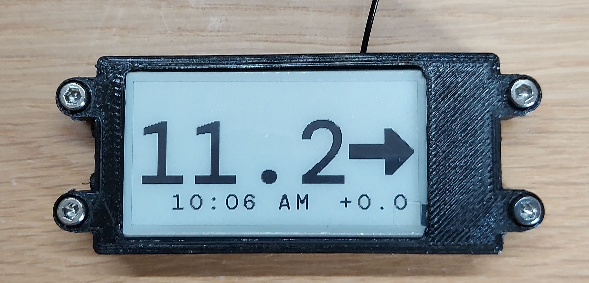
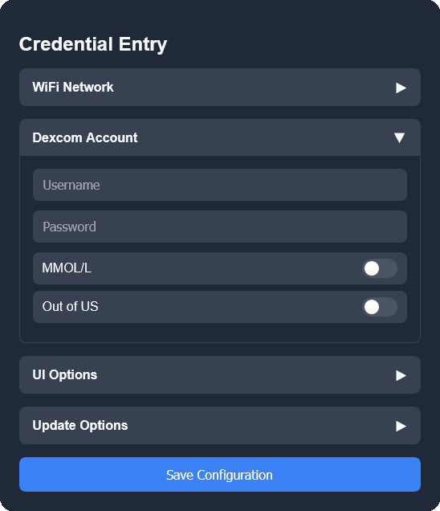
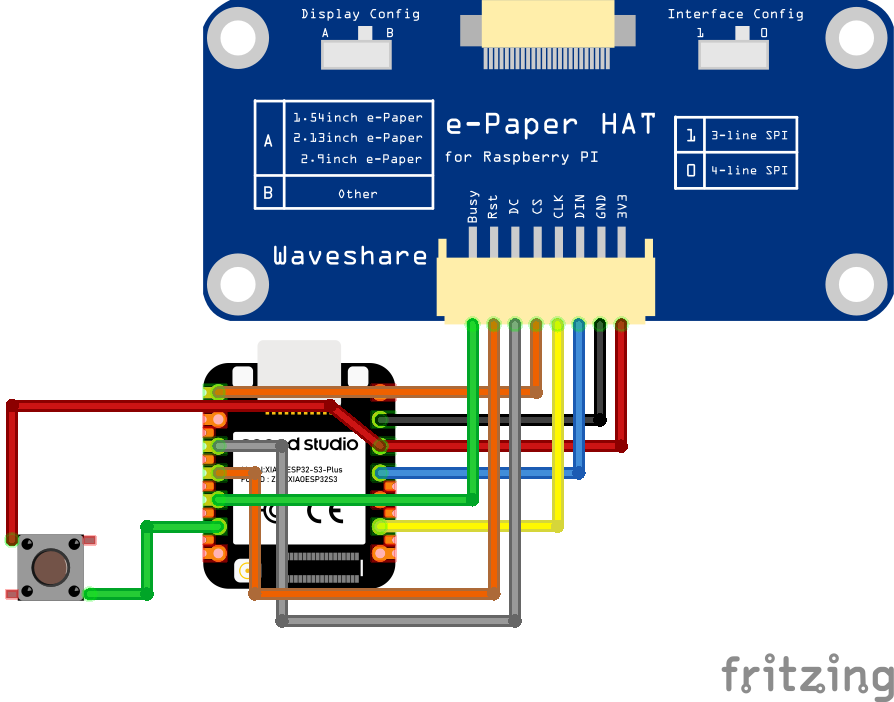

# GlucoView
A wall mounted E-paper display made for type one diabetics, used for checking blood sugar levels at a glance.

### <b style="color:red">WARNING: I am not a medical profesional, do not use this device for treatment decisions. Use ar your own risk.</b>

## Features:
- Uses a web UI and QR codes to make it simple and easy to configure using a smart device.
- Uses the Dexcom api to get glucose readings directly from Dexcom (Nightscout not yet supported)
- Displays delta of glucose level on screen to make it easier to judge the rate of change.
- Uses an epaper screen and deep sleep which allows it to be extremely low power.
- Uses partial updates on the screen so glucose updates display extremely quick.

## Future plans
- Nightscout compatibility.
- Dexcom out of us setting.
- mg/dl option instead of mmol/l.
- List wifi networks rather than enter ssid manualy.
- Graph option for the ui.

## Configuration:
It uses a web ui to configure the wifi and dexcom credentials aswell as other settings. It is accesed by pressing the pairing button on the side of the device and scanning 2 Qr codes (One for the access point and one for the web page).

# Build Your Own

## Parts:
- Esp32 S3 microcontroler from [Seeed Studio](https://www.seeedstudio.com/Seeed-Studio-XIAO-ESP32S3-Plus-p-6361.html) (Specificialy the Seed Studio XIAO ESP32-S3 Plus)
- 2.13 inch E-Paper display from [Waveshare](https://www.waveshare.com/pico-epaper-2.13.htm) (headers need to be de-soldered)
- [Push button](https://www.amazon.co.uk/B0BQ3CKVMT) (6mm x 6mm x 4.5mm)
- [Wire](https://shop.pimoroni.com/products/wire-spool?variant=40461209162) (Any wire will do as long as it is decently thin)
- [M3 x 14mm Bolts](https://www.amazon.co.uk/dp/B01FL898DU)
- M2 x 10mm & M2 x 6mm Bolts & M2 Nuts([M2 screw set](https://www.amazon.co.uk/Screws-Washers-Assortment-Socket-Printer/dp/B0CPHM3RC1))

## Tools required:
- Soldering iron, I recommend the [Pine 64 Pinecil](https://pine64.com/product/pinecil-smart-mini-portable-soldering-iron/).
- [Solder](https://www.amazon.co.uk/B08YRJJCV5) (Any will do, though i would reccomend lead free)
- [Wire cutters](https://shop.pimoroni.com/products/engineer-plastic-nippers?variant=41686138159187) (Any will do, these are just nice high quality ones)
- [Pliers](https://shop.pimoroni.com/products/miniature-needle-nose-pliers?variant=41151537250387) (Again any will do, these are just high quality)
- Alen keys / Screwdriver with alen bits.
- 3d printer or a service like [PCBway](https://www.pcbway.com/) or [jlcPCB](https://jlcpcb.com/)

## Pinout:
| Xiao ESP32 S3  | Device |
| ------------- | ------------- |
| D8 | EPD CLK |
| D10 | EPD DIN |
| D0 | EPD CS |
| D3 | EPD RST |
| D2 | EPD DC |
| D4 | EPD BUSY |
| D5 | BUTTON |

## Wiring Diagram:

### Guide comming soon :)

## Credits:
- Font - [Dm Mono](https://fonts.google.com/specimen/DM+Mono)
- Dexcom Follow Library by [Hynesman](https://github.com/Hynesman/Dexcom_Follow)
- QR Code Libary by [Richard Moore](https://github.com/ricmoo/QRCode?tab=readme-ov-file)